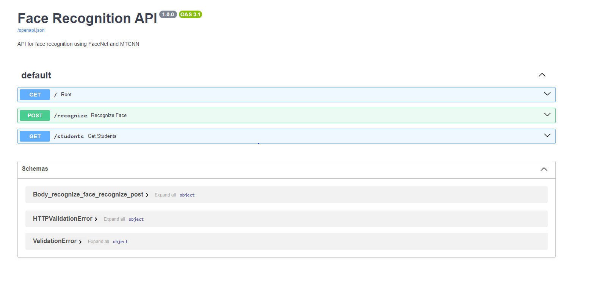
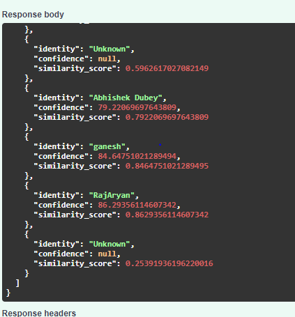
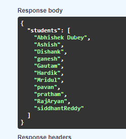
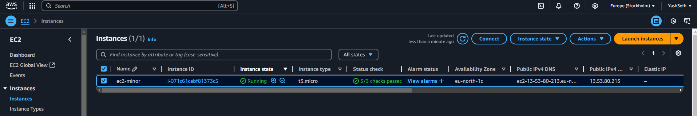
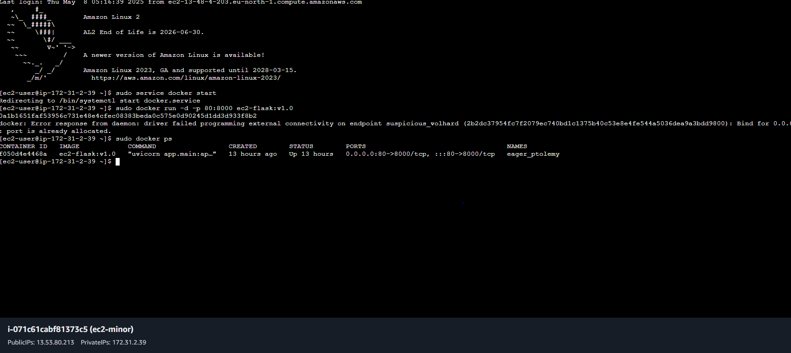
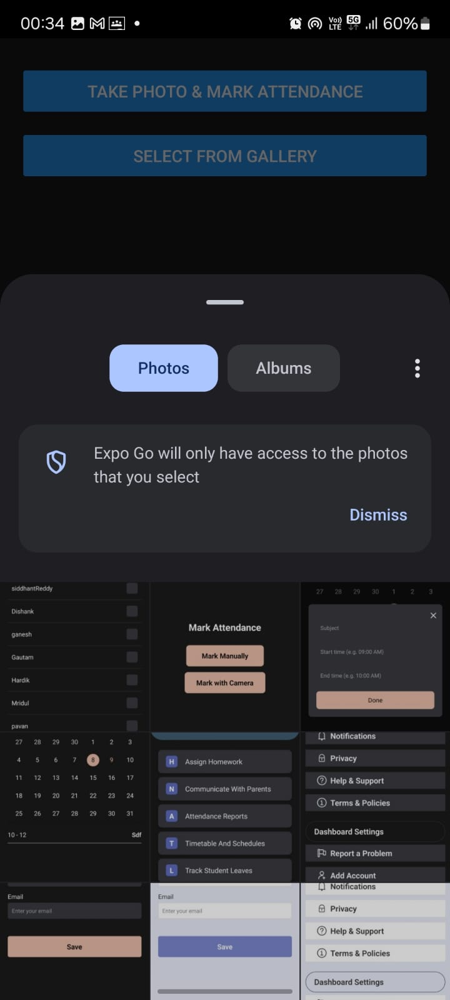
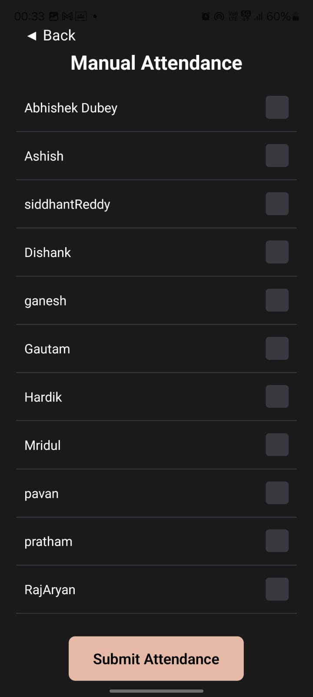
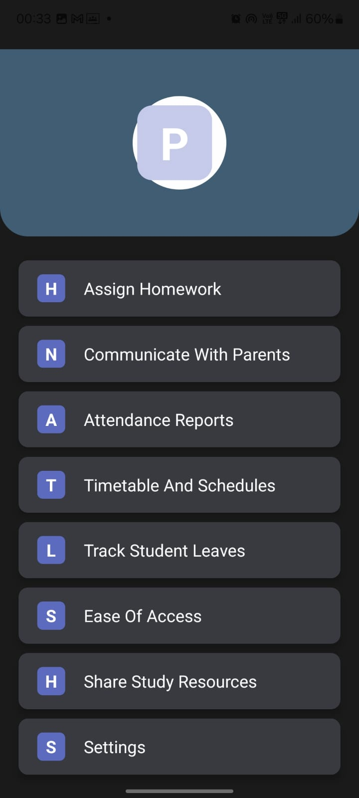
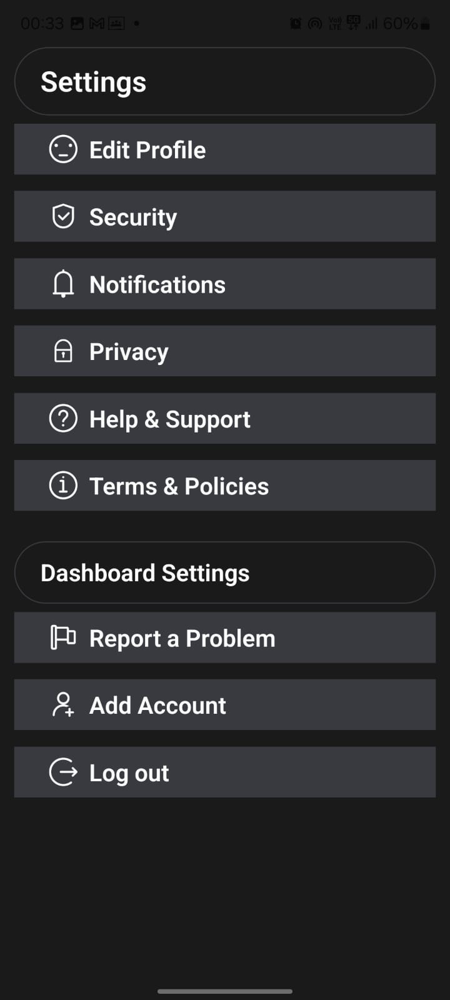

# FaceFusion

FaceFusion is a comprehensive mobile application designed for seamless user experience and powerful face recognition capabilities.

The frontend is built using **React Native** and **Expo**, allowing for cross-platform development for iOS, Android, and Web from a single codebase. Key features include:
*   **Firebase Authentication** for secure user sign-in and management.
*   **React Navigation** for intuitive screen transitions and a robust navigation structure, including bottom tabs and stack navigators.
*   **AsyncStorage** for persisting user preferences like onboarding status.

The backend machine learning service is developed with **Python** and the **FastAPI** framework, known for its high performance. This service is responsible for the core face recognition logic:
*   It utilizes **MTCNN (Multi-task Cascaded Convolutional Networks)** for accurate face detection in uploaded images.
*   A **ResNet (Residual Network)** based model is employed for generating face embeddings and performing recognition.
*   The entire backend is containerized using **Docker** and orchestrated with **docker-compose.yaml**, ensuring easy deployment and scalability.
*   This ML backend is hosted on an **AWS EC2 instance**, providing a reliable and scalable cloud infrastructure.

This combination of technologies allows FaceFusion to deliver a feature-rich mobile experience backed by a powerful and efficient machine learning backend.

## Getting Started

### Prerequisites

* Node.js and npm/yarn
* Expo CLI: `npm install -g expo-cli`

### Installation & Running

1.  **Clone the repository:**
    ```bash
    git clone <your-repository-url>
    cd FaceFusion
    ```
2.  **Install dependencies:**
    ```bash
    npm install
    ```
    or
    ```bash
    yarn install
    ```
3.  **Run the application:**
    *   To start the development server:
        ```bash
        npm start
        ```
        or
        ```bash
        expo start
        ```
    *   To run on Android:
        ```bash
        npm run android
        ```
        or
        ```bash
        expo start --android
        ```
    *   To run on iOS:
        ```bash
        npm run ios
        ```
        or
        ```bash
        expo start --ios
        ```
    *   To run on Web:
        ```bash
        npm run web
        ```
        or
        ```bash
        expo start --web
        ```

## Project Structure

The project is organized into two main parts:

*   **`FaceFusion/`**: Contains the React Native mobile application code.
*   **`FaceFusion Ml/`**: Contains the machine learning model and related backend code.
    *   The backend API is built with Python using the FastAPI framework.
    *   It is hosted on an AWS EC2 instance.
    *   For face recognition, the API utilizes MTCNN (Multi-task Cascaded Convolutional Networks) for face detection and a ResNet (Residual Network) based model for face embedding and recognition.
    *   `app/`: Python application code for the ML service.
    *   `Dockerfile`: Instructions to build a Docker image for the ML service.
    *   `docker-compose.yaml`: Defines and runs multi-container Docker applications.
    *   `requirements.txt`: Python dependencies for the ML service.

## Main Entry Point

The application's entry point is [`FaceFusion/index.js`](FaceFusion/index.js), which registers the main [`App`](FaceFusion/App.js) component.

The [`App`](FaceFusion/App.js) component handles initial setup, including:
*   Checking if the user has seen the onboarding flow using `AsyncStorage`.
*   Managing user authentication state with Firebase.
*   Setting up the root navigation (StackNavigator) based on the onboarding and authentication status.

## Configuration

Application configuration, including name, version, icons, and splash screen, is managed in [`FaceFusion/app.json`](FaceFusion/app.json).

## Dependencies

Key dependencies for the mobile application can be found in [`FaceFusion/package.json`](FaceFusion/package.json).

## Backend API & Deployment

The backend for FaceFusion is a FastAPI application responsible for face recognition tasks. It's containerized using Docker and deployed on an AWS EC2 instance.

### API Endpoints (Swagger UI)


### Example API Responses
**Recognize Endpoint:**


**Students Endpoint:**


### AWS EC2 Deployment
**EC2 Instance:**


**Docker Logs on EC2:**


## Frontend Application Screenshots

Here are some screenshots of the FaceFusion React Native mobile application, showcasing its features and appearance in both light and dark themes.










